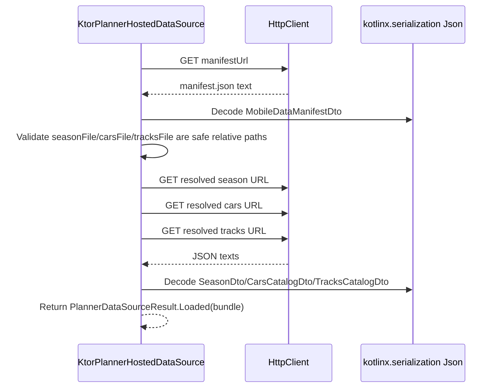
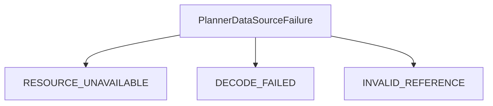
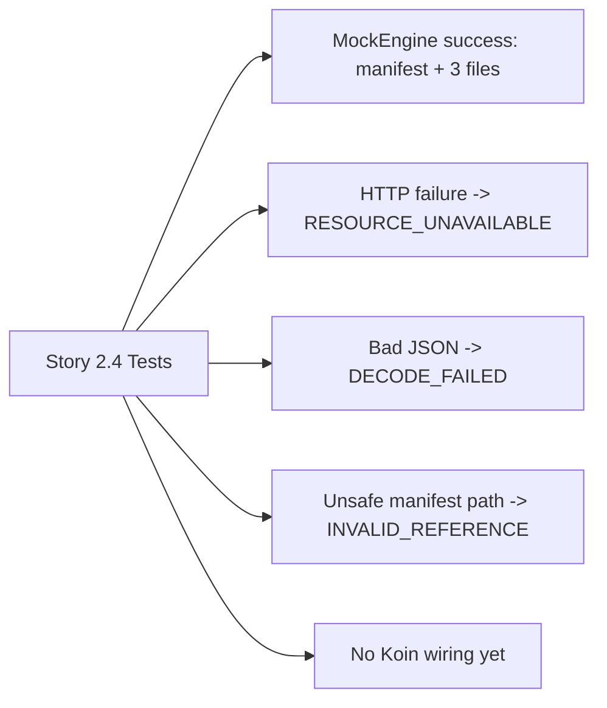

# Story 2.4 Design: Hosted JSON Source Shape

## Context

Sprint 2 prepares the shared data layer for repository, cache, refresh, and presentation-state work. Story 2.4 adds the hosted JSON source shape so hosted mobile data can replace local mock resources later without changing domain or presentation code.

The live sprint story defines these constraints:

- A hosted source supports loading the mobile data manifest and relative `season.json`, `cars.json`, and `tracks.json` paths.
- A Ktor-backed implementation is testable with fake or mock HTTP responses.
- No concrete production hosted URL is required.
- No scraping, iRacing credentials, Firebase, or account sync is introduced.
- Domain and presentation code do not depend on hosted-source DTO, URL, or HTTP details.

The existing local mock source already returns `PlannerDataSourceResult` with a `PlannerDataBundle` containing the manifest, season, cars, and tracks DTOs. Story 2.4 should generalize that boundary instead of adding a separate domain-facing hosted path.

## Chosen Approach

Use a common source-agnostic data-layer interface.

```kotlin
interface PlannerDataSource {
    suspend fun loadPlannerData(): PlannerDataSourceResult
}
```

`ComposeResourcePlannerLocalDataSource` becomes the local implementation. `KtorPlannerHostedDataSource` becomes the hosted implementation. Both return the same `PlannerDataSourceResult` and `PlannerDataBundle` shape.

```mermaid
flowchart TD
    FutureRepo["Story 2.5 Repository / Refresh Provider"]
    Source["PlannerDataSource"]
    Local["ComposeResourcePlannerLocalDataSource"]
    Hosted["KtorPlannerHostedDataSource"]
    Result["PlannerDataSourceResult"]
    Bundle["PlannerDataBundle"]

    FutureRepo --> Source
    Source <|-- Local
    Source <|-- Hosted
    Source --> Result
    Result --> Bundle
```

This keeps future repository code source-agnostic. Domain and presentation still do not know about DTOs, URLs, Ktor, or whether data came from local resources or hosted JSON.

## Hosted Data Flow

The hosted source takes the manifest URL as data-layer configuration. Story 2.4 does not hardcode a production URL.

```kotlin
KtorPlannerHostedDataSource(
    manifestUrl = "https://example.com/data/mobile/v1/manifest.json",
    httpClient = client,
    json = json,
)
```

The load flow is:



Relative resolution follows `docs/data-contract.md`: `/data/mobile/v1/manifest.json` can point to `season.json`, `cars.json`, and `tracks.json` relative to the manifest URL. The hosted source rejects references that are blank, absolute URLs, or path traversal such as `../season.json`.

## Error Handling

Hosted and HTTP details stay inside the data layer. Callers receive `PlannerDataSourceResult.Failure`.



Failure mapping:

- `RESOURCE_UNAVAILABLE`: HTTP non-2xx responses, network failures, timeouts, missing bodies, or local resource read failures.
- `DECODE_FAILED`: malformed JSON or JSON that does not match the DTO requirements.
- `INVALID_REFERENCE`: manifest references that are blank, absolute, escaping, or otherwise unsafe for relative hosted loading.

Each failure includes the logical path or URL being loaded and a concise detail string for tests and diagnostics. Ktor exception types do not leak to domain or presentation. Cancellation still rethrows, matching the current local source behavior.

## Testing

Story 2.4 uses focused source tests and Ktor `MockEngine`.



Required coverage:

- Hosted source loads the manifest, resolves relative file paths, fetches `season.json`, `cars.json`, and `tracks.json`, decodes all DTOs, and returns `PlannerDataSourceResult.Loaded`.
- HTTP non-2xx responses or thrown request failures return `RESOURCE_UNAVAILABLE`.
- Invalid manifest JSON or referenced-file JSON returns `DECODE_FAILED`.
- Absolute URLs, blank references, and path traversal references return `INVALID_REFERENCE`.
- Existing local source tests are adjusted only for the interface generalization.

## Scope Boundaries

In scope:

- Add the common `PlannerDataSource` data-layer interface.
- Adapt the local Compose-resource source to implement that interface.
- Add a Ktor-backed hosted implementation.
- Add Ktor `MockEngine` test dependency if needed.
- Add focused common tests for hosted success and failure behavior.

Out of scope:

- Production hosted URL selection.
- Koin registration or source selection.
- Repository refresh/cache fallback.
- Checksum validation.
- Scraping, iRacing credentials, Firebase, account sync, or UI work.

## Acceptance Mapping

- Hosted source supports manifest-relative file loading: covered by `KtorPlannerHostedDataSource` and relative path tests.
- Ktor-backed implementation is fake/mock HTTP testable: covered by `MockEngine` tests.
- No production URL required: manifest URL is constructor/config input in tests only.
- No scraping, credentials, Firebase, or account sync: excluded by scope.
- Domain and presentation do not depend on hosted details: hosted source stays in the data layer behind `PlannerDataSource`.
